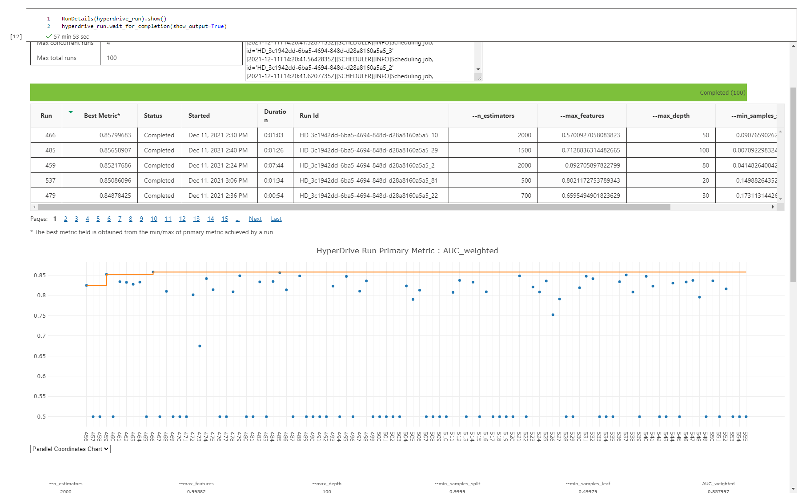

# Comparison of performance between AutoML and hyperdrive from Azure

Generally, telecom companies focus on attracting new clients while at the same time forgetting to retain them. According to this article, increasing customer retention by 5% can increase profits by 25% to 95%.

When customers stop doing business with a company or a particular service, it is called churn. Also, it is known as customer attrition. Hence, it is possible to increase profits by taking actions that are conducive to retaining customers.

Therefore, the goal of the present project is to develop the best model possible using two services from Microsoft Azure: AutoML and Hyperdrive. AutoML is the process of automating the time-consuming, iterative tasks of machine learning model development. Hyperdrive is an Azure Service that is responsible for executing the search for previously defined hyperparameters within a search space, in a way that minimizes the error between the prediction and the actual values.

Figure 1 shows the steps followed in the present Capstone project. The first step starts with the adquisition of the dataset needed for the present project. The dataset is then preprocessed and split into training and test sets. As shown in the flowchart, two models are trained. The first one is a an AutoML model. The second one is a Hyperdrive mode. Both models are tested using the test set. The results are then compared. The best model is selected accordingly. 


**Figure 1:** Flowchart of the project

## Project Set Up and Installation

In order to run this project, this project should be cloned using git repository in a Notebook Terminal. There are two jupyter notebooks: automl.ipynb and hyperparameter_tuning_forest.ipynb.

## Dataset

### Overview
The data set for this classification problem is taken from Kaggle and stems from the IBM sample dataset collection.

https://www.kaggle.com/blastchar/telco-customer-churn

This dataset contains a total of 7043 customers and 21 attributes, coming from personal characteristics, service signatures, and contract details. About 5174 customers are active, and 1869 are churned. The target variable for this dataset is the Churn feature.


### Task

This is a classification problem with an added difficulty: this is a dataset for which the target variable is highly unbalanced.

The dataset contains all the data to predict the behavior to retain customers. Each row represents a customer. Each column contains the customer's attributes. The datasets include information about customers who left within the last month in a column called Churn; services that each customer has signed up for like phone, multiple lines, internet, online security, and others; information about the customer like how long they have been a customer, contract, payment method, and others; demographic information about customers like gender, age range, and if they have partners and dependents. This dataset contains about 7043 unique values and 21 columns.

The dataset was prepared in two ways. The first way was left as it came to feed the AutoML algorithm. This is, registering the dataset in the ML Workspace. The second way was to preprocess the dataset to feed the hyperdrive algorithm. This is done because there are multiple categorical variables, and they need to be encoded adequately to feed the scikit-learn algorithms.

The dataset was also split into train and test with 20% of its data as test data, with the option stratify as true because of the unbalanced proportion between churned and not churned clients.

### Access

The dataset is accessible through the following link:

- https://raw.githubusercontent.com/srees1988/predict-churn-py/main/customer_churn_data.csv


### Results


#### Automated ML

As stated earlier, this is a classification task with its output variable called Churn. 

The following lists was set to perform Automated ML:

- compute_target=cpu_cluster,
- task='classification',
- training_data=train_data,
- test_data = test_data,
- label_column_name='Churn',
- primary_metric='AUC_weighted',
- experiment_timeout_minutes=60,
- max_concurrent_iterations=5,
- max_cores_per_iteration=-1, 
- featurization= 'auto',

The main metric used for this experiment was AUC_weighted because accuracy is not the best metric for this task due to the unbalanced nature of the target variable.

The automl algorithm evaluate the model using the test data, and according to the higher AUC_weighted metric, the best is the model.


     
**Figure 2:** List of algorithms sorted by AUC_weighted.

The best model gives an AUC_weighted of 0.73 and an accuracy of 0.80 when using the test data. Figure 3 shows the confusion matrix of the best model.


     
**Figure 3:** Confusion Matrix over the test dataset.

The best model parameters are:
```
[('datatransformer',
  DataTransformer(
      task='classification',
      is_onnx_compatible=False,
      enable_feature_sweeping=True,
      enable_dnn=False,
      force_text_dnn=False,
      feature_sweeping_timeout=86400,
      featurization_config=None,
      is_cross_validation=True,
      feature_sweeping_config={}
  )),
 ('prefittedsoftvotingclassifier',
  PreFittedSoftVotingClassifier(
      estimators=[('236', Pipeline(
          memory=None,
          steps=[('maxabsscaler', MaxAbsScaler(
              copy=True
          )), ('lightgbmclassifier', LightGBMClassifier(
              boosting_type='gbdt',
              colsample_bytree=0.2977777777777778,
              learning_rate=0.1,
              max_bin=180,
              max_depth=2,
              min_child_weight=3,
              min_data_in_leaf=1e-05,
              min_split_gain=0.5263157894736842,
              n_estimators=600,
              num_leaves=215,
              reg_alpha=1,
              reg_lambda=1,
              subsample=0.7921052631578948,
              random_state=None,
              n_jobs=-1,
              problem_info=ProblemInfo(
                  gpu_training_param_dict={'processing_unit_type': 'cpu'}
              )
          ))],
          verbose=False
      )), ('221', Pipeline(
          memory=None,
          steps=[('maxabsscaler', MaxAbsScaler(
              copy=True
          )), ('lightgbmclassifier', LightGBMClassifier(
              boosting_type='gbdt',
              colsample_bytree=0.1988888888888889,
              learning_rate=0.05789894736842106,
              max_bin=240,
              max_depth=3,
              min_child_weight=8,
              min_data_in_leaf=0.06896862068965517,
              min_split_gain=0.9473684210526315,
              n_estimators=200,
              num_leaves=179,
              reg_alpha=0.894736842105263,
              reg_lambda=0.8421052631578947,
              subsample=0.6436842105263159,
              random_state=None,
              n_jobs=-1,
              problem_info=ProblemInfo(
                  gpu_training_param_dict={'processing_unit_type': 'cpu'}
              )
          ))],
          verbose=False
      )), ('209', Pipeline(
          memory=None,
          steps=[('standardscalerwrapper', StandardScalerWrapper(
              copy=True,
              with_mean=False,
              with_std=True
          )), ('lightgbmclassifier', LightGBMClassifier(
              boosting_type='gbdt',
              colsample_bytree=0.1988888888888889,
              learning_rate=0.05263631578947369,
              max_bin=250,
              max_depth=2,
              min_child_weight=9,
              min_data_in_leaf=0.06896862068965517,
              min_split_gain=0.2631578947368421,
              n_estimators=800,
              num_leaves=131,
              reg_alpha=0.5789473684210527,
              reg_lambda=0.5789473684210527,
              subsample=0.8415789473684211,
              random_state=None,
              n_jobs=-1,
              problem_info=ProblemInfo(
                  gpu_training_param_dict={'processing_unit_type': 'cpu'}
              )
          ))],
          verbose=False
      )), ('226', Pipeline(
          memory=None,
          steps=[('standardscalerwrapper', StandardScalerWrapper(
              copy=True,
              with_mean=False,
              with_std=True
          )), ('lightgbmclassifier', LightGBMClassifier(
              boosting_type='gbdt',
              colsample_bytree=0.1988888888888889,
              learning_rate=0.03158578947368421,
              max_bin=360,
              max_depth=4,
              min_child_weight=4,
              min_data_in_leaf=0.07241655172413794,
              min_split_gain=0.631578947368421,
              n_estimators=600,
              num_leaves=251,
              reg_alpha=0.5789473684210527,
              reg_lambda=0.3684210526315789,
              subsample=0.19842105263157894,
              random_state=None,
              n_jobs=-1,
              problem_info=ProblemInfo(
                  gpu_training_param_dict={'processing_unit_type': 'cpu'}
              )
          ))],
          verbose=False
      )), ('310', Pipeline(
          memory=None,
          steps=[('standardscalerwrapper', StandardScalerWrapper(
              copy=True,
              with_mean=False,
              with_std=True
          )), ('lightgbmclassifier', LightGBMClassifier(
              boosting_type='gbdt',
              colsample_bytree=0.1988888888888889,
              learning_rate=0.07368684210526316,
              max_bin=290,
              max_depth=4,
              min_child_weight=6,
              min_data_in_leaf=0.03104137931034483,
              min_split_gain=0.5263157894736842,
              n_estimators=400,
              num_leaves=230,
              reg_alpha=1,
              reg_lambda=0.7894736842105263,
              subsample=0.19842105263157894,
              random_state=None,
              n_jobs=-1,
              problem_info=ProblemInfo(
                  gpu_training_param_dict={'processing_unit_type': 'cpu'}
              )
          ))],
          verbose=False
      )), ('254', Pipeline(
          memory=None,
          steps=[('standardscalerwrapper', StandardScalerWrapper(
              copy=True,
              with_mean=False,
              with_std=False
          )), ('lightgbmclassifier', LightGBMClassifier(
              boosting_type='goss',
              colsample_bytree=0.8911111111111111,
              learning_rate=0.036848421052631586,
              max_bin=350,
              max_depth=4,
              min_child_weight=0,
              min_data_in_leaf=0.006905862068965518,
              min_split_gain=0,
              n_estimators=50,
              num_leaves=167,
              reg_alpha=1,
              reg_lambda=0.21052631578947367,
              subsample=1,
              random_state=None,
              n_jobs=-1,
              problem_info=ProblemInfo(
                  gpu_training_param_dict={'processing_unit_type': 'cpu'}
              )
          ))],
          verbose=False
      )), ('177', Pipeline(
          memory=None,
          steps=[('sparsenormalizer', Normalizer(
              copy=True,
              norm='l1'
          )), ('lightgbmclassifier', LightGBMClassifier(
              boosting_type='gbdt',
              colsample_bytree=0.2977777777777778,
              learning_rate=0.03158578947368421,
              max_bin=240,
              max_depth=5,
              min_child_weight=7,
              min_data_in_leaf=0.024145517241379314,
              min_split_gain=0.9473684210526315,
              n_estimators=100,
              num_leaves=131,
              reg_alpha=1,
              reg_lambda=0.5789473684210527,
              subsample=0.99,
              random_state=None,
              n_jobs=-1,
              problem_info=ProblemInfo(
                  gpu_training_param_dict={'processing_unit_type': 'cpu'}
              )
          ))],
          verbose=False
      )), ('297', Pipeline(
          memory=None,
          steps=[('standardscalerwrapper', StandardScalerWrapper(
              copy=True,
              with_mean=False,
              with_std=False
          )), ('lightgbmclassifier', LightGBMClassifier(
              boosting_type='goss',
              colsample_bytree=0.7922222222222222,
              learning_rate=0.0842121052631579,
              max_bin=140,
              max_depth=6,
              min_child_weight=8,
              min_data_in_leaf=0.024145517241379314,
              min_split_gain=0.7368421052631579,
              n_estimators=50,
              num_leaves=140,
              reg_alpha=0.6842105263157894,
              reg_lambda=0.21052631578947367,
              subsample=1,
              random_state=None,
              n_jobs=-1,
              problem_info=ProblemInfo(
                  gpu_training_param_dict={'processing_unit_type': 'cpu'}
              )
          ))],
          verbose=False
      )), ('196', Pipeline(
          memory=None,
          steps=[('maxabsscaler', MaxAbsScaler(
              copy=True
          )), ('lightgbmclassifier', LightGBMClassifier(
              boosting_type='gbdt',
              colsample_bytree=0.1,
              learning_rate=0.026323157894736843,
              max_bin=360,
              max_depth=8,
              min_child_weight=5,
              min_data_in_leaf=0.044833103448275874,
              min_split_gain=0.894736842105263,
              n_estimators=600,
              num_leaves=140,
              reg_alpha=0.6842105263157894,
              reg_lambda=0.10526315789473684,
              subsample=0.4457894736842105,
              random_state=None,
              n_jobs=-1,
              problem_info=ProblemInfo(
                  gpu_training_param_dict={'processing_unit_type': 'cpu'}
              )
          ))],
          verbose=False
      )), ('97', Pipeline(
          memory=None,
          steps=[('sparsenormalizer', Normalizer(
              copy=True,
              norm='max'
          )), ('xgboostclassifier', XGBoostClassifier(
              random_state=0,
              n_jobs=-1,
              problem_info=ProblemInfo(
                  gpu_training_param_dict={'processing_unit_type': 'cpu'}
              ),
              booster='gbtree',
              colsample_bytree=0.5,
              eta=0.2,
              max_depth=2,
              max_leaves=0,
              n_estimators=100,
              objective='reg:logistic',
              reg_alpha=1.7708333333333335,
              reg_lambda=1.5625,
              subsample=0.7,
              tree_method='auto'
          ))],
          verbose=False
      )), ('315', Pipeline(
          memory=None,
          steps=[('standardscalerwrapper', StandardScalerWrapper(
              copy=True,
              with_mean=False,
              with_std=False
          )), ('lightgbmclassifier', LightGBMClassifier(
              boosting_type='goss',
              colsample_bytree=0.99,
              learning_rate=0.06842421052631578,
              max_bin=60,
              max_depth=10,
              min_child_weight=4,
              min_data_in_leaf=0.03104137931034483,
              min_split_gain=0.631578947368421,
              n_estimators=50,
              num_leaves=29,
              reg_alpha=0.5789473684210527,
              reg_lambda=0.3157894736842105,
              subsample=1,
              random_state=None,
              n_jobs=-1,
              problem_info=ProblemInfo(
                  gpu_training_param_dict={'processing_unit_type': 'cpu'}
              )
          ))],
          verbose=False
      ))],
      weights=[0.06666666666666667, 0.06666666666666667, 0.06666666666666667, 0.06666666666666667, 0.06666666666666667, 0.06666666666666667, 0.06666666666666667, 0.2, 0.06666666666666667, 0.13333333333333333, 0.13333333333333333],
      flatten_transform=None,
      classification_labels=array([0, 1])
  ))]
```

#### Hyperparameter Tuning

For the hiperparameter search, I used the Random Forest algorithm because it has the following advantages:
- Random forest algorithm can be used for both classification and regression problems.
- It provides higher accuracy than other complex algorithms.
- Random Forest algorithm is a very fast algorithm making it suitable for hyperparameter tuning.
- Random Forest classfier is capable of handling missing values and maintain the accuracy of a large proportion of the data.

The hyperparameters used for the hyperparameter search are:
- n_estimators: Number of trees in the forest. The values used are between 10 and 2000.
- max_features: Maximum number of features to consider when looking for the best split. The values used are evenly chosen between 0.5 and 1.0.
- max_depth: Maximum depth of the tree. The values used here are between 10 and 100.
- min_samples_split: Minimum number of samples required to split an internal node. The values used here are evenly chosen between 0.0001 and 1.0
- min_samples_leaf: Minimum number of samples in newly created leaves. The values used here are evenly chosen between 0.0001 and 0.5.

They are summarized in the following code:

```
# Specify parameter sampler
ps = RandomParameterSampling({
    '--n_estimators': choice(10, 100, 200, 500, 700, 1000, 1500, 2000),
    '--max_features': uniform(0.5, 1.0),
    '--max_depth': choice(10, 20, 30, 40, 50, 60, 70, 80, 90, 100),
    '--min_samples_split': uniform(0.0001, 1.0),
    '--min_samples_leaf': uniform(0.00001, 0.5),
    # '--bootstrap': choice(True, False),
})

````

For early stopping policy I chose BanditPolicy which defines an early termination policy based on slack criteria, and a frequency and delay interval for evaluation. The settings used are:

```
policy = BanditPolicy(slack_factor=0.1, evaluation_interval=2, delay_evaluation=10)
```
To avoid premature termination of training rungs, I use ```delay_evaluation=10```.

Figure 4 shows the different models used for the experiment. The best model delivers an AUC_weighted score of 0.86. The paramters used for the best model are:

- 'max_depth': '70', 
- 'max_features': '0.6415226380137523', 
- 'min_samples_leaf': '0.01669876523599308', 
- 'min_samples_split': '0.049908748267891316', 
- 'n_estimators': '700']


     
**Figure 4:** Hyperdrive run models:

The model is summarized in the following code:

```
RandomForestClassifier(bootstrap=True, ccp_alpha=None, class_weight=None,
                       criterion='gini', max_depth=30,
                       max_features=0.5117122092251563, max_leaf_nodes=None,
                       max_samples=None, min_impurity_decrease=0.0,
                       min_impurity_split=None,
                       min_samples_leaf=0.04802171307868145,
                       min_samples_split=0.1284235927805228,
                       min_weight_fraction_leaf=0.0, n_estimators=1500,
                       n_jobs=None, oob_score=False, random_state=None,
                       verbose=0, warm_start=False)
```


## Model Deployment

The endpoint setting is configured with a computer settings with 1 core and 1 GB of RAM. The authentication is enabled. Also, a scoring script is added to the model in order to consume the model. The codes is as follows:

``` 
print('Set ACI deployment configuration')
config = AciWebservice.deploy_configuration(
    cpu_cores=1,
    memory_gb=1,
    enable_app_insights=True,
    auth_enabled=True
)

inference_config = InferenceConfig(
    entry_script='./script/scoring.py',
    environment=env
)
print('ACI deployment configuration Finished')
```

The endpoint is deployed using the following code: 

```
print('Deploy the model to ACI:')

service_name = 'best-model-service'
service = Model.deploy(
    workspace=ws, 
    name=service_name, 
    models=[model], 
    inference_config=inference_config, 
    deployment_config=config, 
    overwrite=True
)
service.wait_for_deployment(show_output = True)
print(service.state)
```

The best model used is the Hyperdrive Model. This is because the AUC_weighted score is the highest (0.73 against 0.858).


### Consume de the deployed model

Figure 5 shows the status of the endpoint where the model is deployed. 


     
**Figure 5:** Hyperdrive Model deployed:

The model is consumed via a jupyter notebook cell as follows:

```
import requests
import json

headers = {'Content-Type': 'application/json', 'Accept': 'application/json'}

if service.auth_enabled:
    headers['Authorization'] = 'Bearer ' + service.get_keys()[0]
elif service.token_auth_enabled:
    headers['Authorization'] = 'Bearer ' + service.get_token()[0]

scoring_uri = service.scoring_uri

input_data_payload = json.dumps(
    {
        "data":
        [
            {
                "gender": 1.0,
                "SeniorCitizen": 0.0,
                "Partner": 1.0,
                "Dependents": 1.0,
                "tenure": 72.0,
                "PhoneService": 1.0,
                "PaperlessBilling": 0.0,
                "MonthlyCharges": 99.9,
                "TotalCharges": 7251.7,
                "MultipleLines_No": 0.0,
                "MultipleLines_No phone service": 0.0,
                "MultipleLines_Yes": 1.0,
                "InternetService_DSL": 0.0,
                "InternetService_Fiber optic": 1.0,
                "InternetService_No": 0.0,
                "OnlineSecurity_No": 0.0,
                "OnlineSecurity_No internet service": 0.0,
                "OnlineSecurity_Yes": 1.0,
                "OnlineBackup_No": 0.0,
                "OnlineBackup_No internet service": 0.0,
                "OnlineBackup_Yes": 1.0,
                "DeviceProtection_No": 1.0,
                "DeviceProtection_No internet service": 0.0,
                "DeviceProtection_Yes": 0.0,
                "TechSupport_No": 0.0,
                "TechSupport_No internet service": 0.0,
                "TechSupport_Yes": 1.0,
                "StreamingTV_No": 0.0,
                "StreamingTV_No internet service": 0.0,
                "StreamingTV_Yes": 1.0,
                "StreamingMovies_No": 1.0,
                "StreamingMovies_No internet service": 0.0,
                "StreamingMovies_Yes": 0.0,
                "Contract_Month-to-month": 0.0,
                "Contract_One year": 0.0,
                "Contract_Two year": 1.0,
                "PaymentMethod_Bank transfer (automatic)": 1.0,
                "PaymentMethod_Credit card (automatic)": 0.0,
                "PaymentMethod_Electronic check": 0.0,
                "PaymentMethod_Mailed check": 0.0,                
            }

        ]
    }
)

response = requests.post(
    scoring_uri, data=input_data_payload, headers=headers
)

print(response.status_code)
print(response.elapsed)
print(response.json())

```

## Screen Recording

A demonstrative sceencast is posted at https://youtu.be/AGSxlq3588U. This screencast shows the following:
- A working model
- Demo of the deployed  model
- Demo of a sample request sent to the endpoint and its response


